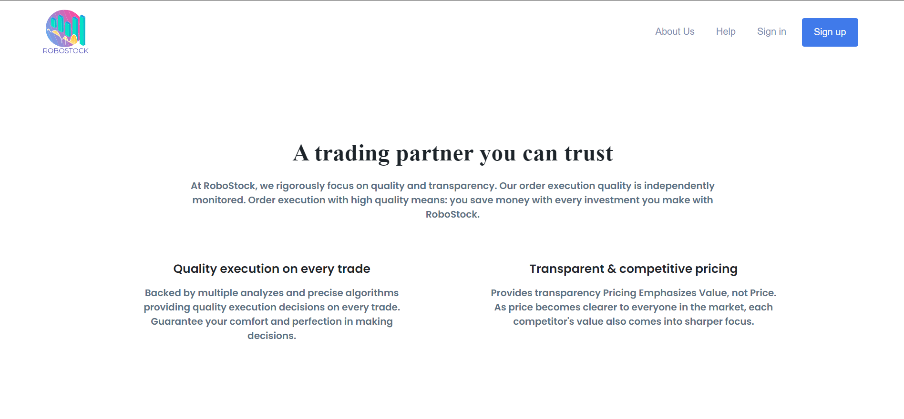
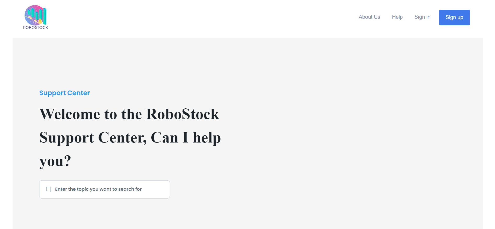

# RoboStock
> [!NOTE]
> This project was Final Project for [Rutger's 332:568's Software Engineering Web Application](https://rutgers.instructure.com/courses/269029/wiki)
## Description
RoboStock is a web application that leverages machine learning techniques to predict stock prices. It aims to
provide users with accurate forecasts for specific stocks. 

The web application consists of the following services:
• Data Retrieval Service: This service fetches historical stock data for the specified stock symbol and date
range from reliable sources, such as Yahoo Finance.

• Machine Learning Service: This service employs a machine learning model, such as LSTM or RNN, trained
on historical stock data to predict future prices.

• Prediction Visualization Service: This service displays predicted stock prices plotted alongside actual
historical data using interactive plots and graphs.

## Project Files

### Landing Page (index.html)

### About Us Page (about_us.html)

### Help Page (help.html)

### Sign In Page ()

### Sign Up Page ()

### Dashboard Page ()

### Profile Page ()

### Transactions Page ()

